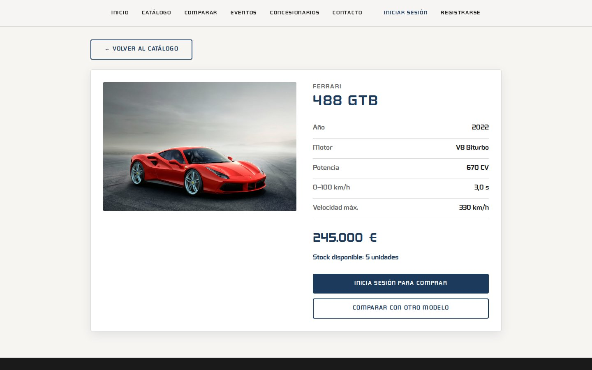
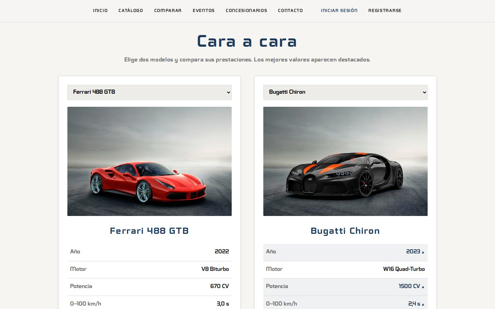
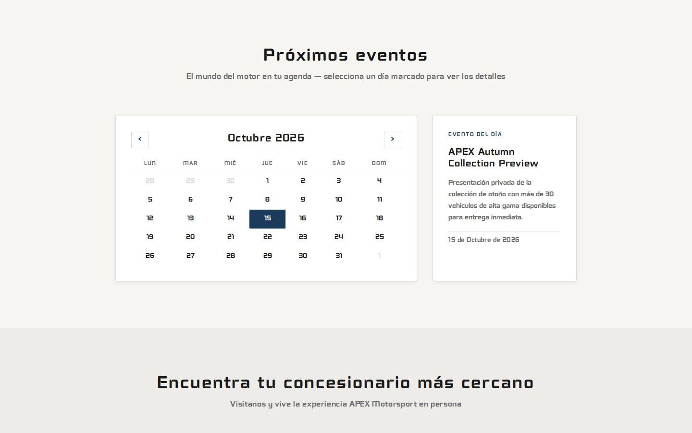
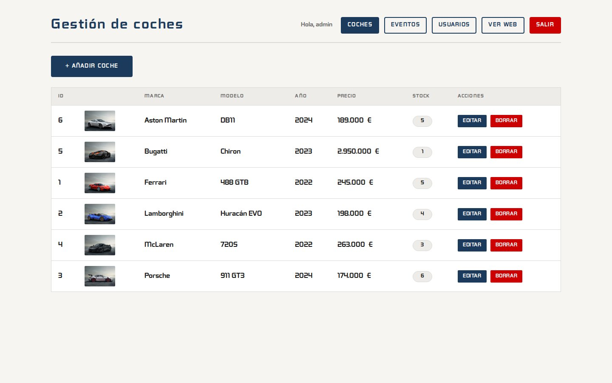
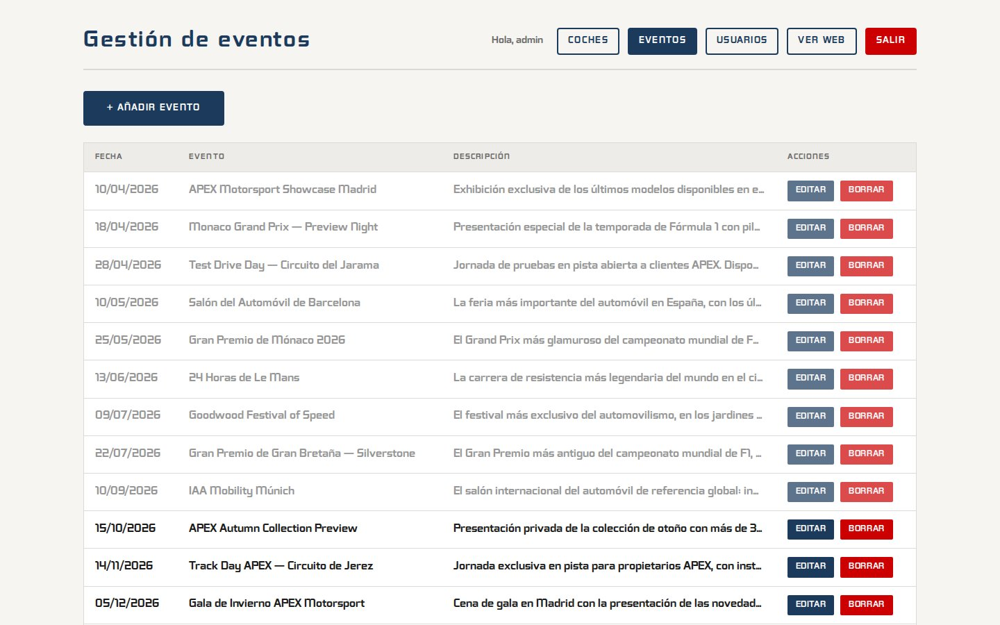
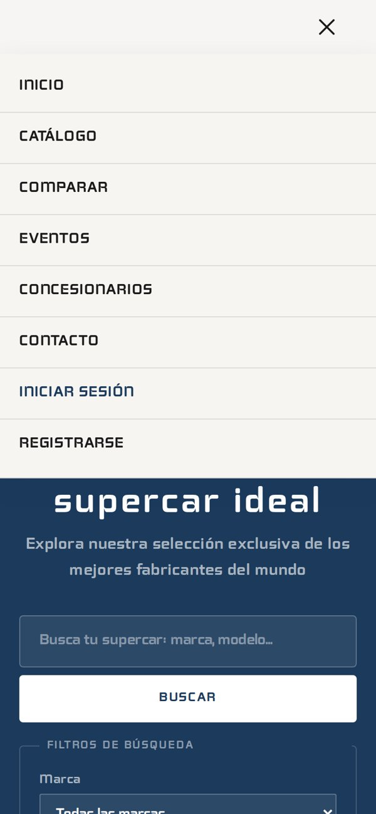
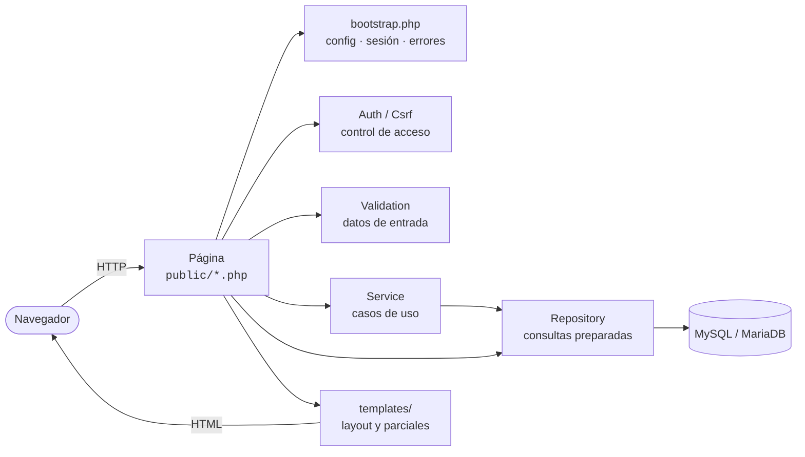
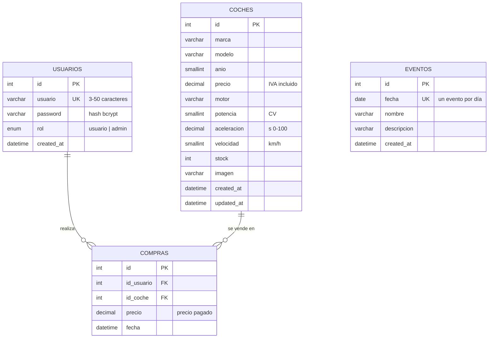

<div align="center">

# APEX Motorsport

**Exclusividad en movimiento — plataforma de venta de supercars de alta gama**


[](https://github.com/gguillex/Apex_motorsport/actions/workflows/tests.yml)
[](LICENSE)


</div>

---

## Índice

1. [Descripción](#descripción)
2. [Funcionalidades](#funcionalidades)
3. [Capturas de pantalla](#capturas-de-pantalla)
4. [Tecnologías](#tecnologías)
5. [Instalación](#instalación)
6. [Configuración](#configuración)
7. [Estructura del proyecto](#estructura-del-proyecto)
8. [Arquitectura](#arquitectura)
9. [Modelo de datos](#modelo-de-datos)
10. [Rutas de la aplicación](#rutas-de-la-aplicación)
11. [API JSON](#api-json)
12. [Seguridad](#seguridad)
13. [Tests](#tests)
14. [Resolución de problemas](#resolución-de-problemas)
15. [Decisiones de diseño](#decisiones-de-diseño)
16. [Posibles mejoras](#posibles-mejoras)
17. [Licencia](#licencia)
18. [Autor](#autor)

---

## Descripción

**APEX Motorsport** es una aplicación web completa para un concesionario de
vehículos de alta gama. Los visitantes pueden explorar el catálogo, filtrar y
comparar modelos, consultar el calendario de eventos y localizar el
concesionario más cercano. Los clientes registrados pueden comprar vehículos y
consultar sus facturas, y los administradores gestionan todo el contenido desde
un panel propio.

El proyecto está desarrollado en **PHP 8 sin frameworks ni dependencias de
Composer**, siguiendo una arquitectura por capas (páginas → servicios →
repositorios) con separación estricta entre lógica y presentación, y cuenta con
una batería de **78 tests automáticos** (unitarios, de integración y de
extremo a extremo).

---

## Funcionalidades

### 🌐 Parte pública

| Funcionalidad | Descripción |
|---|---|
| **Catálogo dinámico** | Cargado por AJAX desde una API JSON, con indicadores de stock («Disponible», «Últimas unidades», «Agotado»). |
| **Buscador y filtros** | Búsqueda instantánea por marca, modelo o año y filtros por marca, precio máximo y año, generados a partir de los datos reales. |
| **Ficha de vehículo** | Especificaciones técnicas, precio, stock disponible y acceso directo a la compra y al comparador. |
| **Comparador cara a cara** | Enfrenta dos modelos y destaca automáticamente el mejor valor de cada prestación. |
| **Calendario de eventos** | Calendario mensual navegable; al pulsar un día marcado se muestran los detalles del evento. |
| **Concesionarios cercanos** | Usa la API de geolocalización del navegador y ordena los concesionarios por distancia (fórmula del haversine). |
| **Logotipo en canvas** | El logotipo de la marca se dibuja con la API Canvas 2D. |
| **Avisos legales** | Privacidad, aviso legal, cookies, términos y accesibilidad en pestañas accesibles enlazables (`legal.php#cookies`). |
| **Diseño responsive** | Adaptado a escritorio, tablet y móvil, con menú hamburguesa accesible por teclado. |

### 👤 Clientes

| Funcionalidad | Descripción |
|---|---|
| **Registro e inicio de sesión** | Alta pública de clientes con validación de datos. |
| **Compra de vehículos** | Proceso transaccional que descuenta stock de forma segura, incluso con compras simultáneas. |
| **Facturas** | Factura con número de serie (`APX-AAAA-NNNNNN`), desglose de base imponible e IVA, lista para imprimir o guardar en PDF. |
| **Historial de compras** | Listado de todas las compras del cliente con acceso a cada factura. |
| **Mi cuenta** | Datos de la cuenta y cambio de contraseña (requiere la contraseña actual). |

### 🛠️ Panel de administración

| Sección | Operaciones |
|---|---|
| **Coches** | Alta, edición y borrado, con subida de fotografía (JPG, PNG o WebP). No se permite borrar coches con compras registradas. |
| **Eventos** | Alta, edición y borrado de los eventos del calendario (uno por día). Los eventos pasados se muestran atenuados. |
| **Usuarios** | Alta, edición (nombre, rol y restablecimiento de contraseña) y borrado. El sistema impide quedarse sin administradores, cambiar el propio rol o borrar la propia cuenta. |

---

## Capturas de pantalla

<table>
  <tr>
    <td width="50%"><p align="center"><b>Catálogo</b></p></td>
    <td width="50%"><p align="center"><b>Ficha de vehículo</b></p></td>
  </tr>
  <tr>
    <td><p align="center"><b>Comparador cara a cara</b></p></td>
    <td><p align="center"><b>Calendario de eventos</b></p></td>
  </tr>
  <tr>
    <td><p align="center"><b>Panel · Gestión de coches</b></p></td>
    <td><p align="center"><b>Panel · Gestión de eventos</b></p></td>
  </tr>
</table>

<p align="center">
  
  &nbsp;&nbsp;
  
  &nbsp;&nbsp;
  
  <br>
  <b>Versión móvil</b>
</p>

---

## Tecnologías

| Capa | Tecnología |
|---|---|
| **Backend** | PHP 8.1+ (tipado estricto, PDO, sesiones nativas) |
| **Base de datos** | MySQL 8 / MariaDB 10.4+ (InnoDB, `utf8mb4`, claves foráneas) |
| **Frontend** | HTML5 semántico, CSS3 (variables, Grid, Flexbox), JavaScript ES2020 |
| **Librerías** | jQuery 3.7 (solo para la petición AJAX del catálogo, cargada desde CDN con SRI) |
| **APIs del navegador** | Canvas 2D, Geolocation, Fetch, History |
| **Servidor** | Apache 2.4 (XAMPP) o servidor embebido de PHP |
| **Tests** | Framework de pruebas propio en PHP + cURL, sin dependencias |

---

## Instalación

### Requisitos

- **PHP 8.1 o superior** con las extensiones `pdo_mysql`, `mbstring` y `fileinfo`.
- **MySQL 8** o **MariaDB 10.4+**.
- Apache con `mod_rewrite` (opcional, recomendado).

> Todas las extensiones necesarias vienen incluidas en XAMPP.

### Opción A · XAMPP (recomendada)

1. **Copia el proyecto** en la carpeta `htdocs` de XAMPP:

   | Sistema | Ruta |
   |---|---|
   | Windows | `C:\xampp\htdocs\Apex_motorsport` |
   | Linux | `/opt/lampp/htdocs/Apex_motorsport` |
   | macOS | `/Applications/XAMPP/htdocs/Apex_motorsport` |

2. **Arranca Apache y MySQL** desde el panel de control de XAMPP
   (en Linux: `sudo /opt/lampp/lampp start`).

3. **Crea la base de datos** importando `database/schema.sql`:
   - Desde **phpMyAdmin** → pestaña *Importar* → selecciona el archivo, o
   - Desde la terminal:
     ```bash
     mysql -u root < database/schema.sql
     ```

   > ⚠️ El script **elimina y vuelve a crear** las tablas de `apex_motorsport`.

4. **Crea el archivo de configuración** a partir de la plantilla:
   ```bash
   cp config/config.example.php config/config.php
   ```
   Los valores por defecto ya funcionan con XAMPP (`root` sin contraseña).

5. **Abre la aplicación** en <http://localhost/Apex_motorsport/>.

### Opción B · Servidor embebido de PHP

Con un MySQL en marcha y la base de datos importada:

```bash
php -S localhost:8000 -t public
```

Y abre <http://localhost:8000>.

### Credenciales iniciales

| Usuario | Contraseña | Rol |
|---|---|---|
| `admin` | `admin123` | Administrador |

> 🔐 **Cambia esta contraseña tras el primer acceso** desde *Mi cuenta*.

---

## Configuración

Toda la configuración está en `config/config.php` (excluido del control de
versiones). La plantilla `config/config.example.php` documenta cada opción:

| Clave | Por defecto | Descripción |
|---|---|---|
| `app.name` | `APEX Motorsport` | Nombre mostrado en los títulos de página. |
| `app.debug` | `false` | Muestra los errores detallados. **Debe ser `false` en producción.** |
| `app.timezone` | `Europe/Madrid` | Zona horaria de PHP y de la conexión a la base de datos. |
| `db.host` / `db.port` | `127.0.0.1` / `3306` | Servidor de base de datos. |
| `db.name` | `apex_motorsport` | Nombre de la base de datos. |
| `db.user` / `db.password` | `root` / *(vacío)* | Credenciales de acceso. |
| `uploads.dir` | `assets/img/coches` | Carpeta (relativa a `public/`) donde se guardan las fotos subidas. |
| `uploads.max_bytes` | `5 MB` | Tamaño máximo de cada foto. |

La variable de entorno `APEX_CONFIG` permite indicar otro archivo de
configuración (útil para entornos de pruebas o CI).

### Despliegue en producción

- Apunta el *DocumentRoot* del servidor a la carpeta **`public/`**.
- Establece `'debug' => false`.
- Da permisos de escritura al usuario del servidor web **solo** sobre
  `public/assets/img/coches/`.
- Sirve la web por **HTTPS**: la cookie de sesión se marca automáticamente como
  `Secure`.

Si no es posible cambiar el *DocumentRoot*, los archivos `.htaccess` incluidos
redirigen todas las peticiones a `public/` y bloquean el acceso directo al
resto de carpetas.

---

## Estructura del proyecto

```
Apex_motorsport/
│
├── public/                      # Única carpeta accesible desde la web
│   ├── index.php                # Portada: buscador, catálogo, eventos, concesionarios
│   ├── coche.php                # Ficha de vehículo
│   ├── comparar.php             # Comparador cara a cara
│   ├── comprar.php              # [POST] Procesa una compra
│   ├── factura.php              # Factura de una compra
│   ├── mis_compras.php          # Historial de compras del cliente
│   ├── cuenta.php               # Mi cuenta y cambio de contraseña
│   ├── login.php                # Inicio de sesión
│   ├── registro.php             # Registro de clientes
│   ├── logout.php               # [POST] Cierre de sesión
│   ├── legal.php                # Avisos legales
│   │
│   ├── api/
│   │   ├── coches.php           # GET · Catálogo en JSON
│   │   └── eventos.php          # GET · Eventos del calendario en JSON
│   │
│   ├── admin/                   # Panel de administración (solo rol admin)
│   │   ├── index.php            # Listado de coches
│   │   ├── coche.php            # Alta / edición de coche
│   │   ├── coche_borrar.php     # [POST] Borrado de coche
│   │   ├── eventos.php          # Listado de eventos
│   │   ├── evento.php           # Alta / edición de evento
│   │   ├── evento_borrar.php    # [POST] Borrado de evento
│   │   ├── usuarios.php         # Listado de usuarios
│   │   ├── usuario.php          # Alta / edición de usuario
│   │   └── usuario_borrar.php   # [POST] Borrado de usuario
│   │
│   └── assets/
│       ├── css/                 # reset, styles (base y componentes), responsive y una hoja por página
│       ├── js/                  # app, catalog, calendar, geolocation, legal, logo
│       ├── fonts/               # Tipografía corporativa
│       └── img/coches/          # Fotografías de los vehículos
│
├── src/                         # Lógica de negocio (namespace App\)
│   ├── bootstrap.php            # Arranque: configuración, autoload, errores, sesión, cabeceras
│   ├── helpers.php              # Funciones auxiliares: e(), url(), asset(), format_price()…
│   ├── Auth.php                 # Autenticación y control de acceso
│   ├── Csrf.php                 # Protección CSRF
│   ├── Config.php               # Acceso a la configuración
│   ├── Database.php             # Conexión PDO
│   ├── ErrorHandler.php         # Gestión centralizada de errores
│   ├── Repository/              # Acceso a datos: Car, Event, Purchase, User
│   ├── Service/                 # Casos de uso: PurchaseService, ImageUploader
│   ├── Validation/              # Validación de formularios: Car, Event, User
│   └── Exception/               # Errores de negocio mostrables al usuario
│
├── templates/                   # Plantillas HTML reutilizables
│   ├── layout/                  # Cabecera y pie (web pública y panel)
│   ├── partials/                # Menú de navegación y mensajes flash
│   ├── legal/                   # Contenido de los avisos legales
│   └── error.php                # Página de error genérica
│
├── config/
│   └── config.example.php       # Plantilla de configuración
│
├── database/
│   └── schema.sql               # Esquema de la base de datos y datos iniciales
│
├── tests/                       # Batería de tests automáticos
│   ├── run.php                  # Ejecutor de tests
│   ├── Unit/                    # Tests unitarios
│   ├── Integration/             # Tests contra la base de datos
│   └── Http/                    # Tests de extremo a extremo
│
└── docs/screenshots/            # Capturas usadas en este documento
```

---

## Arquitectura

La aplicación sigue un patrón **Page Controller** con una arquitectura por
capas. Cada archivo de `public/` es un punto de entrada ligero que coordina las
capas inferiores; **ninguna página contiene SQL** y **ningún repositorio genera
HTML**.



### Ciclo de una petición

1. La página carga `src/bootstrap.php`, que prepara la configuración, el
   autoloader, el manejador de errores, la sesión y las cabeceras de seguridad.
2. Comprueba permisos con `Auth::requireLogin()` o `Auth::requireAdmin()`.
3. En peticiones POST verifica el token con `Csrf::verify()` y valida los datos
   con el validador correspondiente.
4. Ejecuta la operación a través de un **Service** o **Repository**.
5. Aplica el patrón **Post/Redirect/Get**: tras una escritura guarda un mensaje
   *flash* y redirige, evitando reenvíos duplicados al recargar.
6. Renderiza el HTML con las plantillas comunes de `templates/`, escapando toda
   la salida con `e()`.

### Responsabilidades por capa

| Capa | Ubicación | Responsabilidad |
|---|---|---|
| **Páginas** | `public/` | Coordinar la petición: permisos, validación, llamada a la lógica y renderizado. |
| **Servicios** | `src/Service/` | Operaciones con reglas de negocio complejas (compra transaccional, subida de archivos). |
| **Repositorios** | `src/Repository/` | Acceso a datos mediante consultas preparadas y reglas de integridad. |
| **Validadores** | `src/Validation/` | Normalizar y validar la entrada del usuario. |
| **Plantillas** | `templates/` | Presentación HTML reutilizable. |
| **Frontend** | `public/assets/js/` | Módulos independientes encapsulados, sin variables globales. |

---

## Modelo de datos



**Reglas de integridad**

- `compras.precio` guarda el **importe pagado en el momento de la compra**: las
  facturas no cambian aunque después se modifique el precio del vehículo.
- Las claves foráneas usan `ON DELETE RESTRICT`: una compra es un documento
  contable, por lo que no se pueden borrar coches ni usuarios que tengan compras.
- `usuarios.usuario` y `eventos.fecha` son únicos.
- La conexión usa la misma zona horaria que PHP, de modo que las fechas
  guardadas por MySQL y las mostradas por la aplicación siempre coinciden.

---

## Rutas de la aplicación

| Ruta | Método | Acceso | Descripción |
|---|---|---|---|
| `/` · `index.php` | GET | Público | Portada |
| `coche.php?id={id}` | GET | Público | Ficha de vehículo |
| `comparar.php?id={id}&id2={id}` | GET | Público | Comparador |
| `legal.php` | GET | Público | Avisos legales |
| `login.php` | GET · POST | Invitado | Inicio de sesión |
| `registro.php` | GET · POST | Invitado | Registro de clientes |
| `logout.php` | POST | Autenticado | Cierre de sesión |
| `comprar.php` | POST | Autenticado | Realiza una compra |
| `factura.php?id={id}` | GET | Propietario | Factura (solo la del propio cliente) |
| `mis_compras.php` | GET | Autenticado | Historial de compras |
| `cuenta.php` | GET · POST | Autenticado | Mi cuenta / cambio de contraseña |
| `admin/` | GET | Admin | Gestión de coches |
| `admin/coche.php[?id={id}]` | GET · POST | Admin | Alta / edición de coche |
| `admin/eventos.php` | GET | Admin | Gestión de eventos |
| `admin/evento.php[?id={id}]` | GET · POST | Admin | Alta / edición de evento |
| `admin/usuarios.php` | GET | Admin | Gestión de usuarios |
| `admin/usuario.php[?id={id}]` | GET · POST | Admin | Alta / edición de usuario |
| `admin/*_borrar.php` | POST | Admin | Borrado de coches, eventos y usuarios |

**Códigos de respuesta:** los invitados que acceden a zonas privadas son
redirigidos al inicio de sesión; un cliente que intenta entrar al panel recibe
`403`; un recurso inexistente devuelve `404`, y un formulario sin token CSRF
válido devuelve `419`.

---

## API JSON

Ambos endpoints son de solo lectura, responden `application/json; charset=utf-8`
y devuelven `405 Method Not Allowed` ante cualquier método distinto de `GET`.

### `GET /api/coches.php`

Devuelve el catálogo completo ordenado por marca y modelo.

```json
[
  {
    "id": 1,
    "marca": "Ferrari",
    "modelo": "488 GTB",
    "anio": 2022,
    "precio": 245000,
    "motor": "V8 Biturbo",
    "potencia": 670,
    "aceleracion": 3,
    "velocidad": 330,
    "stock": 5,
    "imagen": "assets/img/coches/ferrari-488-gtb.jpg"
  }
]
```

### `GET /api/eventos.php`

Devuelve los eventos indexados por fecha (`AAAA-MM-DD`). Si no hay eventos,
devuelve un objeto vacío `{}`.

```json
{
  "2026-10-15": {
    "name": "APEX Autumn Collection Preview",
    "desc": "Presentación privada de la colección de otoño con más de 30 vehículos…"
  }
}
```

---

## Seguridad

| Amenaza | Medida aplicada |
|---|---|
| **Inyección SQL** | Todas las consultas usan sentencias preparadas de PDO con emulación desactivada. |
| **XSS** | Toda la salida HTML se escapa con `e()`; en JavaScript el DOM se construye con `textContent`, nunca con `innerHTML` sobre datos. |
| **CSRF** | Token sincronizado en sesión y obligatorio en todos los formularios, comparado con `hash_equals()`. |
| **Acciones por URL** | Comprar, borrar y cerrar sesión solo aceptan `POST`. |
| **Contraseñas** | Hash con `password_hash()` (bcrypt) y rehash automático si cambia el algoritmo. |
| **Fijación de sesión** | Se regenera el identificador de sesión al iniciar sesión; modo estricto activado. |
| **Robo de cookies** | Cookie de sesión `HttpOnly`, `SameSite=Lax` y `Secure` bajo HTTPS. |
| **Escalada de privilegios** | El registro público siempre crea clientes; el rol solo se asigna desde el panel y se valida contra una lista cerrada. |
| **Acceso a datos ajenos** | Las facturas se consultan filtrando por el usuario autenticado. |
| **Condiciones de carrera** | La compra bloquea la fila del coche (`SELECT … FOR UPDATE`) dentro de una transacción: el stock nunca queda negativo. |
| **Subida de archivos** | El tipo se comprueba por contenido (`finfo`), se limita el tamaño, el nombre se genera aleatoriamente y la carpeta impide ejecutar scripts. |
| **Fugas de información** | Errores genéricos al usuario y detalle solo en el log; código, configuración y SQL fuera de la carpeta pública. |
| **Clickjacking y MIME sniffing** | Cabeceras `X-Frame-Options: SAMEORIGIN`, `X-Content-Type-Options: nosniff` y `Referrer-Policy`. |
| **Recursos externos** | jQuery cargado con *Subresource Integrity* (SRI). |

---

## Tests

El proyecto incluye un framework de pruebas propio, sin dependencias externas,
que se ejecuta con cualquier instalación de PHP:

```bash
php tests/run.php              # Ejecuta todos los tests
php tests/run.php Unit         # Solo los que contienen «Unit» en su nombre
php tests/run.php EndToEnd     # Solo los tests de extremo a extremo
```

> En XAMPP el ejecutable de PHP está en `C:\xampp\php\php.exe` (Windows) o
> `/opt/lampp/bin/php` (Linux).

Los tests crean y utilizan su propia base de datos, **`apex_motorsport_test`**,
por lo que **nunca modifican los datos reales**. Si MySQL no está disponible,
se ejecutan únicamente los tests unitarios.

| Suite | Tests | Qué cubre |
|---|:---:|---|
| **Unit** | 23 | Validadores de coches, eventos y usuarios; helpers de formato y escape; tokens CSRF. |
| **Integration** | 21 | Repositorios contra la base de datos real, reglas de borrado, hash de contraseñas, compras transaccionales y **compras concurrentes** (varios procesos compitiendo por la última unidad). |
| **Http** | 34 | Extremo a extremo: levanta un servidor PHP y recorre la aplicación como un usuario real (registro, login, compra, factura, permisos, panel de administración, subida de imágenes, inyección SQL, XSS, CSRF, cabeceras de seguridad y APIs). |

```
Tests\Http\EndToEndTest
  ✔ full purchase flow
  ✔ users cannot see other users invoices
  ✔ customers cannot access admin
  ✔ stored xss is escaped everywhere
  ...

78 tests, 296 aserciones, 0 fallos
```

---

## Resolución de problemas

<details>
<summary><b>«No se puede conectar a la base de datos» o página de error 500</b></summary>

- Comprueba que MySQL está arrancado en el panel de XAMPP.
- Revisa las credenciales de `config/config.php`.
- Asegúrate de haber importado `database/schema.sql`.
- Pon temporalmente `'debug' => true` para ver el detalle del error.
</details>

<details>
<summary><b>MySQL no arranca en XAMPP para Linux</b></summary>

Suele deberse a un archivo `.pid` que queda al apagar el equipo sin detener
XAMPP. Elimínalo y vuelve a arrancar:

```bash
sudo rm -f /opt/lampp/var/mysql/*.pid
sudo /opt/lampp/lampp start
```
</details>

<details>
<summary><b>Error 403 al abrir la web con el proyecto fuera de <code>htdocs</code></b></summary>

Si el proyecto está enlazado desde otra carpeta (por ejemplo, desde el
directorio personal), el usuario de Apache (`daemon` en XAMPP para Linux)
necesita permiso para atravesar las carpetas superiores:

```bash
setfacl -m u:daemon:x /home/<usuario>
```
</details>

<details>
<summary><b>No se pueden subir fotos desde el panel</b></summary>

El usuario del servidor web necesita permiso de escritura en
`public/assets/img/coches/`:

```bash
setfacl -m u:daemon:rwx public/assets/img/coches      # XAMPP en Linux
```

Comprueba también que la imagen es JPG, PNG o WebP y no supera 5 MB (y el
límite `upload_max_filesize` de `php.ini`).
</details>

<details>
<summary><b>«La sesión del formulario ha caducado» (error 419)</b></summary>

La sesión ha expirado o el formulario se abrió en otra sesión. Recarga la
página e inténtalo de nuevo.
</details>

<details>
<summary><b>He olvidado la contraseña del administrador</b></summary>

Reimportar `database/schema.sql` restablece `admin` / `admin123`, pero
**borra todos los datos**. Para conservarlos, genera un hash y actualízalo
directamente:

```bash
php -r 'echo password_hash("NuevaClave123", PASSWORD_DEFAULT), PHP_EOL;'
```

```sql
UPDATE usuarios SET password = '<hash generado>' WHERE usuario = 'admin';
```
</details>

---

## Decisiones de diseño

- **PHP sin framework.** Permite mostrar explícitamente cada pieza (enrutado por
  archivos, sesión, CSRF, acceso a datos) y funciona en cualquier XAMPP sin
  instalar nada más. La estructura por capas facilitaría migrar a un framework.
- **Repositorios y servicios.** Aíslan el SQL y las reglas de negocio de la
  presentación, y hacen posible probar la lógica de forma independiente.
- **Catálogo por AJAX.** El filtrado es instantáneo en el cliente sin recargar
  la página; el servidor solo expone los datos mediante una API JSON.
- **Precio guardado en cada compra.** Garantiza que las facturas sean
  inmutables, como exige cualquier documento contable.
- **Borrado restringido.** Coches y usuarios con compras no se eliminan; para
  retirar un vehículo de la venta basta con dejar su stock a cero.
- **Tests sin dependencias.** Un pequeño framework propio evita requerir
  Composer y permite ejecutar las pruebas en cualquier entorno.
- **Imágenes optimizadas.** Las fotografías se redimensionaron y comprimieron
  (de ~14 MB a ~1 MB en total) para acelerar la carga, especialmente en móvil.

---

## Posibles mejoras

- Recuperación de contraseña por correo electrónico.
- Paginación y ordenación del catálogo en el servidor para grandes volúmenes.
- Pasarela de pago real (Stripe, Redsys) y reserva con señal.
- Generación de facturas en PDF en el servidor.
- Galería de varias fotografías por vehículo.
- Limitación de intentos de inicio de sesión.
- Integración continua que ejecute los tests en cada cambio.

---

## Licencia

Este proyecto se distribuye bajo la licencia **MIT**. Consulta el archivo
[`LICENSE`](LICENSE) para más información.

---

## Autor

**Guillermo García Andugar** · [@gguillex](https://github.com/gguillex)
